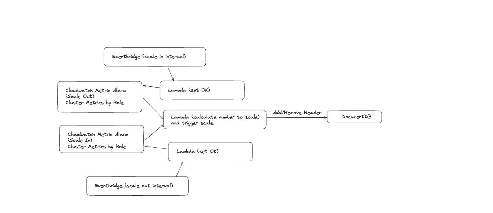

# AWS DocumentDB Autoscaler

## What is docdb-autocaler?
Excellent question. It's our very own custom AWS DocumentDB Autoscaler, because as of 28/11/2024 AWS DocumentDB does not support autoscaling.
This service will help autoscale the reader instances of your DocumentDB cluster with set of rules which will be explained below.

## Features:
1. Option to scale dynamically using a desired metric & target threshold (ex: CPUUtilization) or scheduled scaling. Scheduled scaling policy will add the number of replicas based on the environment variable set `SCHEDULE_NUMBER_REPLICAS` on the lambda function.
2. Abide to the minimum and maximum replicas set.
3. Only manage the instances that were created by it. Instances created with the dynamic scaling policy with have the tag `docdb-autoscaler-create = true`. While the instances created with the scheduled scaling policy will have the tag `docdb-autoscaler-scheduler = true`.
4. Calculate and ensure it does not spin up more than 15 read replicas as that's the hard limit set by AWS.
5. Will not perform any scale-in activity if the instance is not in an available state.
6. Calculate the desired number of replicas to scale out using a formulae. And only scale in 1 replica at a time.
7. Removes the reader instance with the most instances in a single Az.
8. Supports a dryRun feature to only log out the activity but do not perform any actual scaling activities.
9. Supports creating the replicas following the writer instance size & type if not explicitly specified. There's an option to pass in the env var `INSTANCE_TYPE` to choose the instance type to set when scaling.

### Metric Driven Scaling Policy:
1. It's invoked by a Cloudwatch alarm based on the threshold set.
2. Only adds/removes reader instances to the documentdb cluster.
3. Currently only supports 1 metric and 1 cluster to scale at a time.
4. This service can only remove the reader instances that was created by it. It uses the tag `docdb-autoscaler-create = true`.
5. Scaling out it can add multiple readers instances at once to match the desired state while in the constraints of the min & max set.
6. Scaling in, only removes 1 reader instance at a time to be conservative.

### Scheduled Scaling Policy:
1. Adds reader instances to the DocumentDB cluster based on the env var set `SCHEDULE_NUMBER_REPLICAS`
2. If no reader instances in the DocumentDB cluster with the tag `docdb-autoscaler-scheduler = true` it will mean it's a scale out action.
If there are existing reader instances in the DocumentDB cluster with the tag `docdb-autoscaler-scheduler = true` it will be a scale in action.
3. Schedule to trigger the DocDB-Autoscaler Lambda function is set via AWS EventBridge.

## Architecture
Autoscaling via metric.

### Notes:
1. This current service is co-dependant with the `cw-alarm-manager` service. In order for this to work correctly. [Link](https://github.com/cheelim1/cw-alarm-manager). Only needed when using for autosaling based on `metrics`.
2. This autoscaler will only provision additional reader instances. It will not intefere with the existing instances present in the cluster.
3. This autoscaler will only remove 1 instance at at time.
4. Formulae to calculate the desired reader instances the DocumentDB currently needs, it's using the formulae -> 

### HOW TO USE:
1. Verify the docker image is valid. It should be available here: [LINK](https://github.com/cheelim1/docdb-autoscaler/pkgs/container/docdb-autoscaler)
2. Enable DocumentDB Autoscaling via Terraform, which can be found here -> [LINK](https://github.com/cheelim1/docdb-autoscaler/tree/main/infrastructure/examples)
3. Pull the docker image into your AWS ECR. AWS Lambda container images must reside in AWS ECR.

### Debug & Troubleshooting
1. Go to the AWS Lambda function -> Monitor & check if the Lambda function was invoked
2. Further debug using Cloudwatch logs.
3. Check the Cloudwatch Alarms and History
4. Check EventBridge rules
5. Check the Lambda Permissions & Environment Variables 